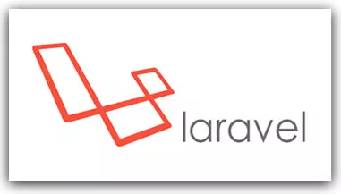
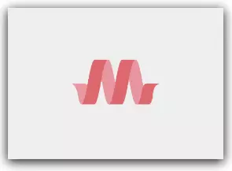
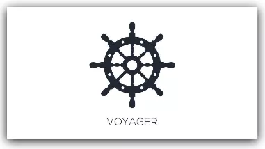
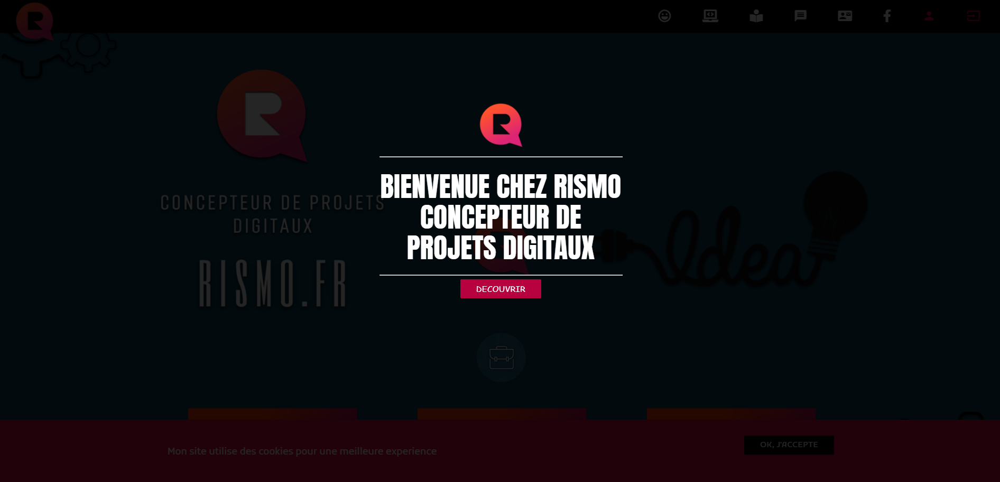

## Mon portfolio

### Ce site  sert de support pour presenter mes projets, portfolio, formations.
### Plate-formes de conception graphique utilisées : CANVA, CRELLO, ADOBE XD
 

## Frameworks utilisés
* Laravel/Php  ( BACKEND ) 

* Materialize, javascript, jquery  ( FRONTEND )

## Systeme d'administration 
* Voyager

---
## Demo

